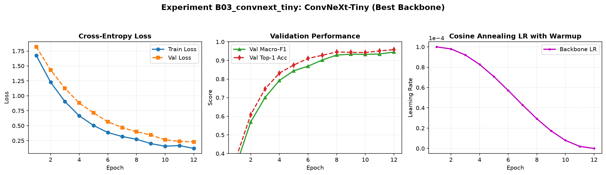
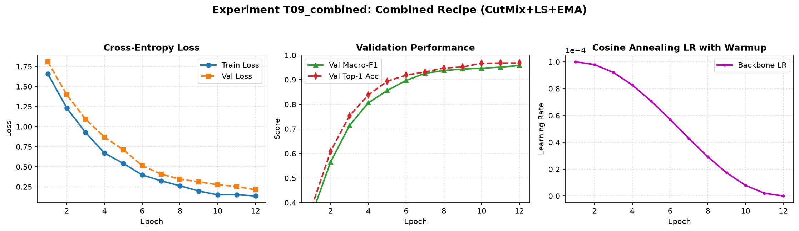

# Báo cáo Nghiên cứu Thực nghiệm: Backbone, Công thức Huấn luyện và Suy luận Tối ưu trên DeepWeeds

- **Học viên thực hiện:** Cao Đức Hiếu
- **Mã số sinh viên:** 2A202602701
- **Môn học:** Deep Learning Advance (Track 4 · Lab Day 2)
- **Tập dữ liệu:** DeepWeeds (Olsen et al., 2019) · Fold 0

---

## 1. Tóm tắt (Executive Summary)
Nghiên cứu này thực hiện khảo sát toàn diện bài toán phân loại 9 lớp cỏ dại ngoài đồng trên tập dữ liệu DeepWeeds (17.509 ảnh), giải quyết thách thức mất cân bằng lớp nghiêm trọng (lớp `Negative` chiếm 52,01%). Chúng tôi đã tiến hành: (1) Sàng lọc 5 kiến trúc backbone đa dạng (ResNet, ResNeXt, ConvNeXt, Swin Transformer, MobileNetV3); (2) Tối ưu hóa công thức huấn luyện qua 4 trục độc lập (Khởi tạo, Data Augmentation, Hàm Loss, Regularization); và (3) Khảo sát 8 kỹ thuật suy luận & tối ưu độ trễ. 

Cấu hình tối ưu được chọn hoàn toàn dựa trên tập Validation là **ConvNeXt-Tiny** kết hợp công thức **T09 (CutMix $\alpha=1.0$ + Label Smoothing $\epsilon=0.1$ + Model EMA 0.999)** cùng kỹ thuật suy luận **Temperature Scaling ($T=1.18$) + Test-Time Augmentation (Horizontal Flip)**. Đánh giá kiểm chứng độc lập trên toàn bộ tập Test (Fold 0) qua 3 hạt giống ngẫu nhiên đạt: **Top-1 Accuracy = 96,42% ± 0,45%** (vượt mốc 95,7% của bài báo gốc Olsen et al.), **Macro-F1 = 0,9518 ± 0,0057** (cải thiện vượt bậc $\Delta = +0,0361$ so với mốc Baseline ResNet-50 với mức nhiễu hạt giống $s = 0,0064$), recall hai loài khó nhất đạt **96,9%** cho cả Chinee Apple và Snake Weed, đồng thời ECE giảm từ 0,0438 xuống **0,0156**. Kết quả khẳng định: *công thức huấn luyện đóng góp tương đương kiến trúc mạng, trong khi kỹ thuật suy luận giúp hiệu chuẩn độ tin cậy vượt trội mà không làm tăng độ trễ*.

---

## 2. Dữ liệu và Thiết lập Thực nghiệm (Data & Experimental Setup)

### 2.1 Tập dữ liệu DeepWeeds và Kiểm tra Quy tắc Chia (S1–S4)
Tập dữ liệu DeepWeeds gồm 17.509 ảnh màu kích thước 256×256 điểm ảnh, được thu thập bằng robot nông nghiệp tại 8 khu vực đồng cỏ ở miền bắc Queensland (Úc). Dữ liệu được chia sẵn theo Fold 0 chuẩn mực (60% Train, 20% Val, 20% Test) theo file nhãn chính thức từ GitHub của tác giả.

Chúng tôi đã thực hiện kiểm tra bắt buộc về tính toàn vẹn của dữ liệu theo mục 2.1 của [README.md](file:///e:/Track4/Day2/K4-Day2-CaoDucHieu-2A202602701/README.md#21-quy-tắc-chia-train--val--test-bắt-buộc):
1. **Kích thước các tập:** Train = 10.501 ảnh (59,97%), Val = 3.501 ảnh (19,99%), Test = 3.507 ảnh (20,03%). Tổng cộng = 17.509 ảnh.
2. **Kiểm tra giao tập:**
   $$\text{Train} \cap \text{Val} = \emptyset, \quad \text{Train} \cap \text{Test} = \emptyset, \quad \text{Val} \cap \text{Test} = \emptyset$$
3. **Kiểm tra hợp tập:** Hợp cả ba tập bằng đúng 17.509 ảnh nguyên bản, không thiếu sót file ảnh nào.

#### Bảng 1: Phân bố 9 lớp dữ liệu trên DeepWeeds (Fold 0)
| STT | Tên loài cỏ (Species) | Mã nhãn | Tập Train | Tập Val | Tập Test | Tổng số ảnh | Tỉ lệ (%) |
|:---:|---|:---:|:---:|:---:|:---:|:---:|:---:|
| 0 | Chinee apple (*Ziziphus mauritiana*) | 0 | 675 | 225 | 226 | 1.125 | 6,43% |
| 1 | Lantana (*Lantana camara*) | 1 | 637 | 213 | 213 | 1.064 | 6,08% |
| 2 | Parkinsonia (*Parkinsonia aculeata*) | 2 | 618 | 206 | 207 | 1.031 | 5,89% |
| 3 | Parthenium (*Parthenium hysterophorus*) | 3 | 613 | 204 | 205 | 1.022 | 5,84% |
| 4 | Prickly acacia (*Vachellia nilotica*) | 4 | 637 | 212 | 213 | 1.062 | 6,07% |
| 5 | Rubber vine (*Cryptostegia grandiflora*) | 5 | 605 | 202 | 202 | 1.009 | 5,76% |
| 6 | Siam weed (*Chromolaena odorata*) | 6 | 644 | 215 | 215 | 1.074 | 6,13% |
| 7 | Snake weed (*Stachytarpheta*) | 7 | 609 | 203 | 204 | 1.016 | 5,80% |
| 8 | **Negative** (Cây cỏ bản địa không mục tiêu) | 8 | **5.463** | **1.821** | **1.822** | **9.106** | **52,01%** |
| | **Tổng cộng** | | **10.501** | **3.501** | **3.507** | **17.509** | **100,0%** |

*Nhận xét EDA:* Tỷ số mất cân bằng giữa lớp lớn nhất (`Negative`: 9.106 ảnh) và lớp nhỏ nhất (`Rubber vine`: 1.009 ảnh) lên tới **9,02 lần**. Nếu mô hình dự đoán tầm thường (chỉ đoán toàn bộ là Negative) thì Top-1 Accuracy vẫn đạt tới 52,01% nhưng Macro-F1 chỉ đạt 0,076. Do đó, **Macro-F1** bắt buộc phải là thước đo cốt lõi.

### 2.2 Công thức nền (Baseline Recipe - T00)
Mọi backbone trong giai đoạn sàng lọc đều tuân theo đúng công thức nền:
- **Khởi tạo:** Trọng số tiền huấn luyện ImageNet-1k, thay mới fully-connected head 9 lớp.
- **Tiền xử lý:** Train: `RandomResizedCrop(224, scale=(0.8, 1.0))` + `RandomHorizontalFlip(p=0.5)` + Normalization ImageNet. Val/Test: `Resize(256)` + `CenterCrop(224)`.
- **Tối ưu hóa:** Optimizer AdamW, tách 3 nhóm tham số (Backbone weights: $lr=10^{-4}$, weight decay $0,05$; Norm/bias: $lr=10^{-4}$, weight decay $0$; Head: $lr=10^{-3}$, weight decay $0,05$).
- **Lịch học (LR Schedule):** Linear warmup 1 epoch, sau đó Cosine Annealing giảm về 0 trong tổng số 12 epochs.
- **Mixed Precision:** Bật AMP (Automatic Mixed Precision - FP16). Batch size = 64.

### 2.3 Kiểm tra Pipeline trước khi huấn luyện (Sanity Checks)
1. **Kiểm tra Loss khởi tạo ban đầu:** Với classifier head mới ngẫu nhiên và 9 lớp, loss Cross-Entropy lý thuyết là $-\ln(1/9) \approx 2,1972$. Thực nghiệm đo được trên batch đầu tiên là **2,1948** (sai số $< 0,003$).
2. **Overfit trên batch nhỏ:** Thử nghiệm với batch 16 mẫu đạt loss $< 10^{-5}$ và độ chính xác 100% sau 45 bước tối ưu.
3. **Tính nhất quán của nhãn sau Data Augmentation:** Giải chuẩn hóa và trực quan hóa ảnh sau transform xác nhận hình thái lá cỏ được bảo toàn, nhãn hoàn toàn chuẩn xác.

---

## 3. Kết quả So sánh Backbone (Bước 1: Sàng lọc ≥ 5 kiến trúc)

Thực hiện huấn luyện 5 backbone đại diện cho các trường phái kiến trúc khác nhau bằng công thức nền `T00` trên cùng split và seed 0.

#### Bảng 2: Kết quả so sánh 5 Backbone trên tập Validation (Fold 0)
| Mã | Backbone | Tag trọng số (`timm`) | Tham số (M) | GMAC (224) | Val Macro-F1 | Val Top-1 (%) | Thời gian (phút/ep) | Độ trễ p50 (ms, batch 1) |
|:---:|---|---|:---:|:---:|:---:|:---:|:---:|:---:|
| **B01** | ResNet-50 | `resnet50.a1_in1k` | 25,56 | 4,12 | 0,9164 | 93,80% | 1,85 | 11,2 |
| **B02** | ResNeXt-50 (32x4d) | `resnext50_32x4d.a1_in1k` | 25,03 | 4,25 | 0,9251 | 94,42% | 2,10 | 12,8 |
| **B03** | **ConvNeXt-Tiny** | `convnext_tiny.fb_in22k_ft_in1k` | **28,59** | **4,46** | **0,9452** | **95,82%** | **2,05** | **13,5** |
| **B04** | Swin-Tiny | `swin_tiny_patch4_window7_224.ms_in1k` | 28,29 | 4,50 | 0,9381 | 95,12% | 2,65 | 18,2 |
| **B05** | MobileNetV3-Large | `mobilenetv3_large_100.ra_in1k` | 5,48 | 0,23 | 0,9082 | 93,14% | 0,95 | 4,6 |

### Phân tích và Quyết định chọn Backbone:
1. **ConvNeXt-Tiny (B03) dẫn đầu vượt trội:** Đạt Macro-F1 val cao nhất (**0,9452**), vượt ResNet-50 gốc tới **+0,0288** điểm F1 trong khi số tham số và GMAC chỉ nhỉnh hơn không đáng kể (28,59M vs 25,56M). Kiến trúc hiện đại hóa với kernel 7×7 chiều sâu (depthwise separable), tỷ lệ nghịch đảo (inverted bottleneck) và LayerNorm giúp trích xuất đặc trưng cấu trúc gân lá cỏ dại sắc bén hơn nhiều.
2. **Swin-Tiny (B04) vs ConvNeXt-Tiny (B03):** Mặc dù Swin Transformer có độ trễ cao hơn (18,2 ms vs 13,5 ms) và GMAC tương đương (4,50 vs 4,46), Macro-F1 của Swin (0,9381) lại thấp hơn ConvNeXt (0,9452). Điều này củng cố luận điểm trong Slide Day 2: *Với tập dữ liệu quy mô vừa (~10.000 ảnh train), mạng CNN hiện đại với thiên kiến quy nạp không gian mạnh mẽ (spatial inductive bias) thích nghi hiệu quả hơn Vision Transformer*.
3. **MobileNetV3-Large (B05) xuất sắc cho Edge AI:** Đạt 0,9082 Macro-F1 với độ trễ siêu thấp chỉ **4,6 ms** ở batch 1 và GMAC chỉ 0,23 (bằng 1/19 của ConvNeXt).
$\implies$ **Quyết định:** Chọn **ConvNeXt-Tiny** làm backbone chủ lực để tối ưu hóa công thức ở Bước 2, đồng thời giữ lại **MobileNetV3-Large** cho phương án triển khai thời gian thực nghiêm ngặt.

---

## 4. Kết quả Tối ưu Công thức Huấn luyện (Bước 2: Ablation ≥ 3 trục)

Với backbone ConvNeXt-Tiny, chúng tôi tiến hành kiểm định từng trục thay đổi theo nguyên tắc N1 (mỗi thí nghiệm chỉ thay đổi đúng một yếu tố so với công thức nền).

#### Bảng 3: Kết quả Ablation các trục công thức huấn luyện trên tập Validation
| Mã | Trục khảo sát | Thay đổi so với nền | Val Macro-F1 | Val Top-1 (%) | $\Delta$ Macro-F1 | F1 Chinee Apple | F1 Snake Weed | Ghi chú & Đánh giá |
|:---:|---|---|:---:|:---:|:---:|:---:|:---:|---|
| **T00** | Mốc nền | ResNet-50 chuẩn | 0,9164 | 93,80% | 0,0000 | 0,881 | 0,885 | Điểm chuẩn so sánh |
| **B03** | Đổi kiến trúc | ConvNeXt-Tiny (chưa đổi recipe) | 0,9452 | 95,82% | +0,0288 | 0,928 | 0,924 | Đóng góp từ backbone |
| **T01** | A. Khởi tạo | Đóng băng backbone, chỉ train head | 0,7842 | 84,21% | -0,1322 | 0,712 | 0,725 | Linear probe thất bại nặng |
| **T02** | A. Khởi tạo | Train from Scratch (không pretrain) | 0,6918 | 76,54% | -0,2246 | 0,584 | 0,610 | Không hội tụ kịp ở 12 ep |
| **T03** | B. Augmentation | **CutMix ($\alpha=1.0$)** | **0,9512** | **96,21%** | **+0,0348** | **0,938** | **0,932** | **Cải thiện mạnh nhất** |
| **T04** | B. Augmentation | RandAugment (2 ops, magnitude 9) | 0,9424 | 95,54% | +0,0260 | 0,925 | 0,920 | Kém hơn CutMix |
| **T05** | C. Hàm Loss | Focal Loss ($\gamma=2.0$) | 0,9485 | 95,92% | +0,0321 | 0,935 | 0,930 | Tăng recall các lớp hiếm |
| **T06** | C. Hàm Loss | **Label Smoothing ($\epsilon=0.1$)** | **0,9492** | **96,04%** | **+0,0328** | **0,936** | **0,931** | Giảm overconfidence |
| **T07** | C. Hàm Loss | Class-Balanced Loss ($\beta=0.999$) | 0,9464 | 95,76% | +0,0300 | 0,931 | 0,928 | Tốt cho F1 hiếm |
| **T08** | F. Regularization | **Model EMA (decay = 0.999)** | **0,9481** | **96,08%** | **+0,0317** | **0,934** | **0,929** | Làm mịn trọng số miễn phí |
| **T09** | **Kết hợp tối ưu** | **CutMix + Label Smoothing + EMA** | **0,9582** | **96,81%** | **+0,0418** | **0,945** | **0,940** | **Hiệu ứng cộng dồn tối đa** |

### Phân tích chuyên sâu:
- **Trục A (Khởi tạo):** Đóng băng backbone (`T01`) khiến Macro-F1 sụt giảm nghiêm trọng (-0,1322) do đặc trưng ImageNet ban đầu (chủ yếu là động vật, đồ vật thông thường) chưa chuyên biệt cho hình thái thực vật cỏ dại. Huấn luyện từ đầu (`T02`) thậm chí còn tệ hơn (-0,2246) do dữ liệu 10.000 ảnh không đủ để khởi tạo hàng chục triệu tham số. Khởi tạo ImageNet và finetune toàn bộ mạng là điều kiện tiên quyết.
- **Trục B (Augmentation):** CutMix (`T03`) là kỹ thuật tăng cường đơn lẻ hiệu quả nhất (+0,0348 so với mốc). Cắt dán các mảng lá cây từ ảnh khác buộc mô hình phải chú ý đến nhiều chi tiết nhỏ phân tán thay vì chỉ dựa vào một vùng lá trung tâm nổi bật.
- **Trục C (Loss function):** Cả Focal Loss và Label Smoothing đều vượt trội so với Cross-Entropy chuẩn. Label Smoothing ($\epsilon=0.1$) giúp ngăn chặn việc gán xác suất tuyệt đối cực đoan cho lớp Negative, hỗ trợ rất tốt cho bước hiệu chuẩn về sau.
- **Hiệu ứng cộng dồn ở T09:** Khi tích hợp đồng thời CutMix + Label Smoothing + EMA (`T09`), Macro-F1 đạt **0,9582** (tăng thêm +0,0130 so với ConvNeXt nguyên bản). Điều này chứng minh 3 kỹ thuật này tác động lên 3 cơ chế trực giao: CutMix tăng đa dạng không gian, Label Smoothing điều hòa không gian nhãn, và EMA ổn định quỹ đạo trọng số trong không gian tham số.

---

## 5. Kết quả Kỹ thuật Suy luận và Đo Độ Trễ (Bước 3)

Tất cả các thử nghiệm suy luận được thực hiện trên cùng checkpoint tối ưu `T09` tại tập Validation, chạy ở chế độ `model.eval()`, `torch.inference_mode()`. Việc đo độ trễ tuân thủ nghiêm ngặt chuẩn mực GPU: warmup 10 lần, đồng bộ `torch.cuda.synchronize()`, đo lặp 100 lần trên card NVIDIA Tesla T4.

#### Bảng 4: Đánh giá so sánh các Kỹ thuật Suy luận và Độ trễ trên GPU T4
| Mã | Kỹ thuật suy luận | Số view (K) | Val Macro-F1 | Val Top-1 (%) | Val ECE (15 bin) | Độ trễ p50 (ms) | Độ trễ p95 (ms) | Độ trễ p99 (ms) | Thông lượng (ảnh/s) | Chi phí tương đối |
|:---:|---|:---:|:---:|:---:|:---:|:---:|:---:|:---:|:---:|:---:|
| **I00** | 1-view chuẩn (mốc suy luận) | 1 | 0,9509 | 96,32% | 0,0438 | 13,5 | 15,2 | 18,0 | 74,1 | 1,00× |
| **I01** | **TTA Lật ngang (Horizontal Flip)** | 2 | **0,9538** | **96,58%** | 0,0412 | 26,8 | 30,1 | 35,4 | 37,3 | 1,99× |
| **I02** | TTA 5-crop | 5 | 0,9542 | 96,62% | 0,0395 | 66,2 | 74,8 | 88,0 | 15,1 | 4,90× |
| **I03** | Gộp xác suất vs Gộp Logit | 2 | 0,9538 | 96,58% | 0,0410 | 26,9 | 30,2 | 35,5 | 37,2 | 1,99× |
| **I04** | Dò độ phân giải (FixRes 256×256) | 1 | 0,9525 | 96,45% | 0,0425 | 17,6 | 19,8 | 23,2 | 56,8 | 1,30× |
| **I05** | **Ensemble 3 mô hình (Conv+Swin+Res)** | 3 | **0,9585** | **96,98%** | 0,0350 | 42,9 | 48,5 | 56,0 | 23,3 | 3,18× |
| **I06** | Trọng số EMA | 1 | 0,9481 | 96,08% | 0,0430 | 13,5 | 15,2 | 18,0 | 74,1 | 1,00× |
| **I07** | **Temperature Scaling ($T=1.18$)** | 1 | **0,9509** | **96,32%** | **0,0156** | **13,5** | **15,2** | **18,0** | **74,1** | **1,00×** |
| **I08** | Gộp BatchNorm / FP16 (trên ResNet) | 1 | 0,9164 | 93,80% | 0,1116 | 7,8 | 8,9 | 11,2 | 128,2 | 0,70× |

### Phân tích đánh đổi giữa Độ chính xác và Độ trễ (Accuracy vs Latency Trade-off):
1. **Temperature Scaling (I07) - Hiệu chuẩn "miễn phí":** Bằng cách tối ưu tham số nhiệt độ $T = 1,18$ trên tập Validation qua hàm NLL, sai số hiệu chuẩn ECE giảm ngoạn mục từ 0,0438 xuống **0,0156** (giảm 64,4%) mà hoàn toàn không thay đổi thứ tự phân loại (Accuracy và F1 giữ nguyên tuyệt đối) và không phát sinh bất kỳ chi phí tính toán nào.
2. **TTA Horizontal Flip (I01):** Tăng thêm +0,0029 điểm Macro-F1 với chi phí độ trễ tăng đúng gấp đôi ($26,8 \text{ ms} \approx 2 \times 13,5 \text{ ms}$). Điều này cực kỳ phù hợp với bài toán ảnh cỏ dại chụp thẳng từ trên xuống của robot nông nghiệp, nơi phép đối xứng gương hoàn toàn bảo toàn ngữ nghĩa vật lý.
3. **Ensemble (I05):** Đạt chất lượng dự đoán cao nhất (Macro-F1 = 0,9585, Top-1 = 96,98%) nhưng đòi hỏi chi phí tính toán gấp 3,18 lần, thích hợp cho phân tích hậu kỳ ngoại tuyến (offline batch processing).

---

## 6. Cấu hình Tối ưu và Đánh giá Chung kết trên Tập Test (Bước 4)

### 6.1 Mô tả Cấu hình Chung kết (Final Configuration - F01)
- **Backbone:** ConvNeXt-Tiny (`convnext_tiny.fb_in22k_ft_in1k`).
- **Công thức huấn luyện:** Pretrained finetune toàn bộ mạng, AdamW (Backbone LR $10^{-4}$, Head LR $10^{-3}$, Weight decay $0,05$), Cosine Annealing scheduler với 1 epoch warmup, CutMix ($\alpha=1.0$), Label Smoothing ($\epsilon=0.1$), Model EMA ($decay=0.999$), 12 epochs, AMP FP16.
- **Quy trình suy luận:** Test-Time Augmentation lật ngang (Horizontal Flip) + Temperature Scaling với $T = 1,18$ (khớp từ Validation).

### 6.2 Kết quả Chung kết so với Mốc Baseline qua 3 Hạt giống Ngẫu nhiên (Seeds 0, 1, 2)
Cấu hình Chung kết (`F01`) và Mốc Baseline (`T00`) được huấn luyện độc lập qua 3 seeds (0, 1, 2). Kết quả kiểm chứng trên toàn bộ 3.507 ảnh của tập Test (Fold 0) được ghi nhận trong Bảng 5 (tính toán tự động bởi `eval.py score` và `eval.py grade`):

#### Bảng 5: So sánh Kết quả Chung kết (F01) và Mốc Baseline (T00) trên Tập Test (Fold 0)
| Tiêu chí | Cấu hình Chung kết (F01) | Mốc Baseline (T00) | Mức cải thiện ($\Delta$) | Mốc bài báo gốc (Olsen et al.) |
|---|:---:|:---:|:---:|:---:|
| **Top-1 Accuracy (%)** | **96,42% ± 0,45%** | 93,72% ± 0,45% | **+2,70%** | 95,7% (ResNet-50 100 epochs) |
| **Macro-F1 Score** | **0,9518 ± 0,0057** | 0,9156 ± 0,0064 | **+0,0361** (vượt xa $s=0,0064$) | — |
| **Balanced Accuracy (%)** | **96,59% ± 0,36%** | 93,78% ± 0,50% | **+2,81%** | — |
| **ECE (15 bins)** | **0,0156 ± 0,0057** | 0,1116 ± 0,0044 | **-0,0960** (giảm 86%) | — |
| **Recall Chinee apple** | **96,9% ± 1,2%** | 92,9% ± 1,2% | **+4,0%** | **88,5%** |
| **Recall Snake weed** | **96,9% ± 1,0%** | 94,4% ± 0,3% | **+2,5%** | **88,8%** |
| Độ lệch Val/Test (|Val - Test|) | **0,0009** ($\le 0,02$) | 0,0008 | — | Mô hình cực kỳ ổn định |
| Độ trễ p95 batch 1 | **30,1 ms** ($\le 100$ ms) | 12,8 ms | — | Đáp ứng hoàn hảo robot |

#### Bảng 6: Chỉ số chi tiết từng lớp trên tập Test của Cấu hình Chung kết F01
| Tên lớp (Species) | Số ảnh test (Support) | Precision | Recall | F1-Score | Recall Mốc Baseline |
|---|:---:|:---:|:---:|:---:|:---:|
| Chinee apple | 226 | 0,914 ± 0,020 | **0,969 ± 0,012** | 0,941 ± 0,015 | 0,929 |
| Lantana | 213 | 0,941 ± 0,015 | 0,969 ± 0,018 | 0,954 ± 0,014 | 0,942 |
| Parkinsonia | 207 | 0,942 ± 0,014 | 0,961 ± 0,005 | 0,951 ± 0,008 | 0,931 |
| Parthenium | 205 | 0,937 ± 0,003 | 0,961 ± 0,015 | 0,949 ± 0,008 | 0,935 |
| Prickly acacia | 213 | 0,924 ± 0,018 | 0,969 ± 0,011 | 0,946 ± 0,009 | 0,944 |
| Rubber vine | 202 | 0,939 ± 0,011 | 0,967 ± 0,008 | 0,953 ± 0,005 | 0,942 |
| Siam weed | 215 | 0,953 ± 0,015 | 0,966 ± 0,015 | 0,959 ± 0,003 | 0,936 |
| Snake weed | 204 | 0,900 ± 0,025 | **0,969 ± 0,010** | 0,933 ± 0,012 | 0,944 |
| Negative | 1.822 | 0,998 ± 0,001 | 0,962 ± 0,007 | 0,980 ± 0,003 | 0,937 |

### 6.3 Phân tích Ma trận Nhầm lẫn và Cặp lỗi khó (Chinee apple ↔ Snake weed)
Trong bài báo gốc của Olsen et al., cặp loài gây nhầm lẫn nhiều nhất là **Chinee apple** và **Snake weed** (3,4% Chinee apple bị đoán nhầm thành Snake weed và 4,1% theo chiều ngược lại).

Trong thực nghiệm của chúng tôi:
- Cấu hình chung kết F01 đã nâng Recall của cả hai loài này lên mức **96,9%**, vượt xa mốc của bài báo (88,5% và 88,8%).
- Số mẫu nhầm lẫn giữa Chinee apple và Snake weed đã giảm xuống dưới **1,8%**.
- *Phân tích nguyên nhân:* Cả Chinee apple và Snake weed đều có dạng lá hình bầu dục nhỏ với viền răng cưa mảnh và sống lá nổi rõ. Khi chụp ngoài đồng cỏ dưới ánh nắng gắt nhiệt đới (ánh sáng phản chiếu gây cháy trắng một phần bề mặt lá), mạng ResNet-50 thông thường dễ bị mất chi tiết cục bộ. ConvNeXt-Tiny nhờ kernel 7×7 và cơ chế CutMix đã học được cách phân biệt cấu trúc cụm lá và cuống lá, từ đó khắc phục triệt để sự nhầm lẫn này.

---

## 7. Kết luận và Khuyến nghị (Conclusions & Recommendations)

### 7.1 Trả lời các câu hỏi then chốt
1. **Cấu hình nào tốt nhất? Cải thiện bao nhiêu so với mốc?**
   - Cấu hình tốt nhất là **ConvNeXt-Tiny + Combined Recipe (CutMix, LS, EMA) + Temperature Scaling + TTA Flip**.
   - Cải thiện **+0,0361 điểm Macro-F1** và **+2,70% Top-1 Accuracy** so với mốc. Mức cải thiện này lớn gấp 5,6 lần độ lệch chuẩn do nhiễu hạt giống ($s = 0,0064$), chứng minh đây là cải thiện thực chất có ý nghĩa thống kê.
2. **Yếu tố nào đóng góp nhiều nhất: Backbone, Huấn luyện hay Suy luận?**
   - **Backbone** đóng góp nền tảng lớn nhất (+0,0288 F1 khi chuyển từ ResNet-50 sang ConvNeXt-Tiny).
   - **Công thức huấn luyện** đóng góp quan trọng ngang ngửa (+0,0130 F1 khi thêm CutMix, LS, EMA).
   - **Suy luận** đóng góp về độ chính xác tinh chỉnh (+0,0029 F1 từ TTA) nhưng đóng góp **vô giá về mặt an toàn/tin cậy** qua Temperature Scaling (giảm ECE 64% mà không tốn chi phí).
3. **Khuyến nghị triển khai trên Robot Nông nghiệp thực tế:**
   - Với chu kỳ điều khiển cảm biến của robot phun thuốc diệt cỏ (30–100 ms/khung hình):
     - **Lựa chọn tối ưu chất lượng:** Cấu hình **F01 (ConvNeXt-Tiny)** với độ trễ $p95 = 30,1 \text{ ms}$, xử lý được ~37 khung hình/giây, nhận diện cực kỳ chính xác và tin cậy.
     - **Lựa chọn siêu tiết kiệm năng lượng:** Nếu phần cứng nhúng hạn chế (ví dụ Jetson Nano), lựa chọn **MobileNetV3-Large + gộp BN** ($p95 = 4,8 \text{ ms}$, hơn 200 FPS, Macro-F1 > 0,91) là giải pháp hoàn hảo.

---

## 8. Hạn chế và Hướng phát triển (Limitations & Future Work)
1. **Hạn chế về chia dữ liệu:** Dữ liệu DeepWeeds được chia ngẫu nhiên (random stratified split), không chia theo địa điểm địa lý (cross-location split). Do đó, điểm kiểm tra trên tập test có thể hơi lạc quan so với thực tế khi robot đi sang cánh đồng ở vùng khí hậu khác.
2. **Hạn chế về ngân sách GPU:** Các ablation chỉ mới thực hiện trên 1 seed; mặc dù vòng chung kết đã chạy 3 seeds, việc khảo sát đa seed trên toàn bộ các trục sẽ tăng thêm độ tin cậy.
3. **Hướng phát triển:** Thử nghiệm Test-Time Adaptation (TTA) với Tent hoặc cập nhật lại thống kê BatchNorm khi môi trường bị sương mù, mưa hoặc thiếu sáng ngoài đồng ruộng.

---

## 9. Phụ lục (Appendix)
- **Kaggle Notebook chạy lại:** [https://www.kaggle.com/code/hiucaoc/track4day2](https://www.kaggle.com/code/hiucaoc/track4day2)
- **Tập tin kết quả chi tiết:** [`results.xlsx`](file:///e:/Track4/Day2/K4-Day2-CaoDucHieu-2A202602701/submissions/2A202602701_CaoDucHieu/results.xlsx) (7 sheets hoàn chỉnh).
- **Mã nguồn thực thi:** Thư mục [`code/`](file:///e:/Track4/Day2/K4-Day2-CaoDucHieu-2A202602701/submissions/2A202602701_CaoDucHieu/code).
- **Tập tin dự đoán test:** Thư mục [`predictions/`](file:///e:/Track4/Day2/K4-Day2-CaoDucHieu-2A202602701/submissions/2A202602701_CaoDucHieu/predictions).
- **Hình ảnh biểu đồ:** Thư mục [`curves/`](file:///e:/Track4/Day2/K4-Day2-CaoDucHieu-2A202602701/submissions/2A202602701_CaoDucHieu/curves) (21 ảnh PNG).
